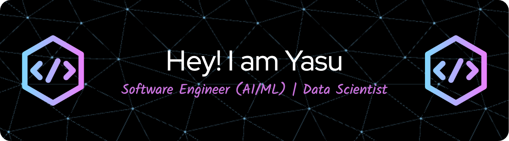

<h4>
I'm a Software Engineer passionate about AI security, adversarial machine learning, and large language models (LLMs). 
I love working on cutting-edge AI research, developing secure and robust models, and contributing to open-source projects. 

</h4>

---

### 🔥 GitHub Stats
<div align="center">
     
     
</div>

<br/>
<div align="center">
     
</div>

---

### 🛠️ Technologies & Tools

<p>
    
    
    
    
    
    
    
    
    
    
    
    
    
    
    
    
    
    
     
</p>

---

### 💡 Current Focus
- 🔍 **AI Security Research**: Exploring LLM adversarial attacks and safety evaluations
- 🏆 **Kaggle**: Working towards earning a Silver Medal
- 📚 **OSS Contributions**: Developing secure AI applications & contributing to the AI community
- 🚀 **GCP & Cloud Computing**: Optimizing AI workloads and improving deployment efficiency

---

### 🌎 Connect with Me

<p align="center">
    <a href="https://github.com/yasu52" target="_blank">
        
    </a>
    <a href="https://www.linkedin.com/in/yoshida-yasuhiro/" target="_blank">
        
    </a>
</p>

---

### 📊 Profile Views & Visitors

<p align="center">
    
    
</p>

<!-- WakaTime Activity (Optional) -->
<!--START_SECTION:waka-->
```text
No activity tracked
